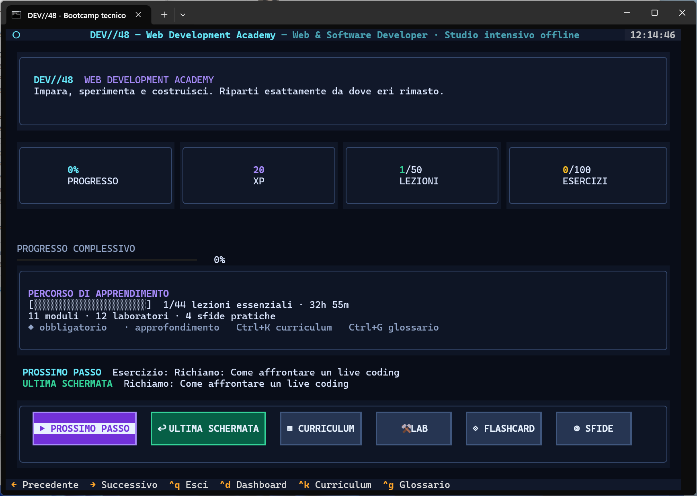
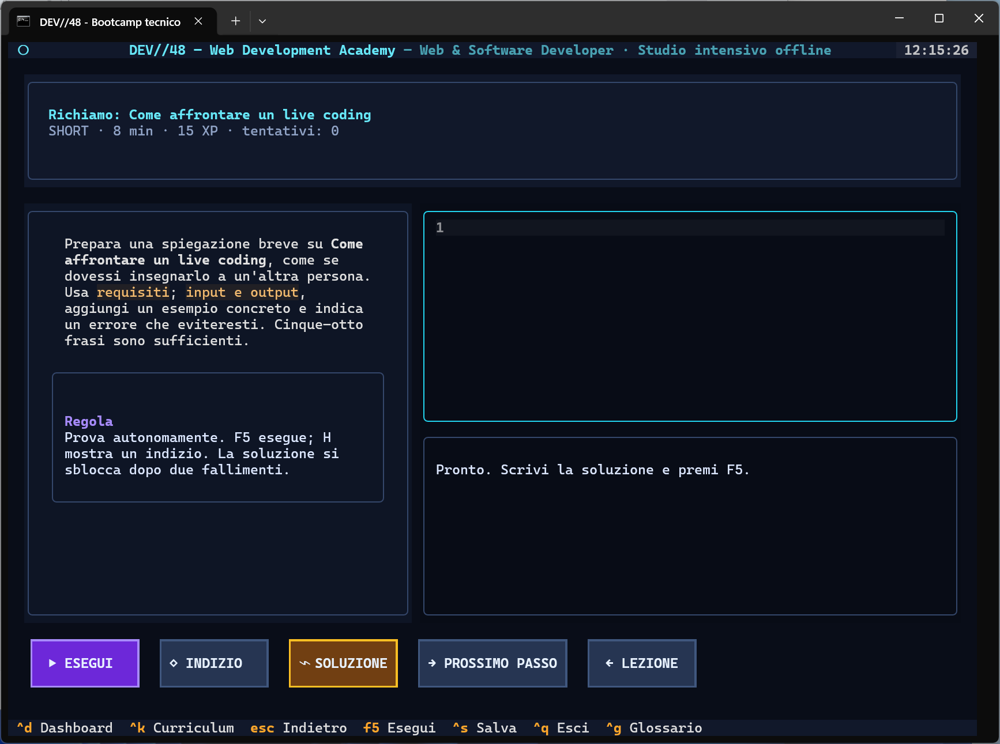
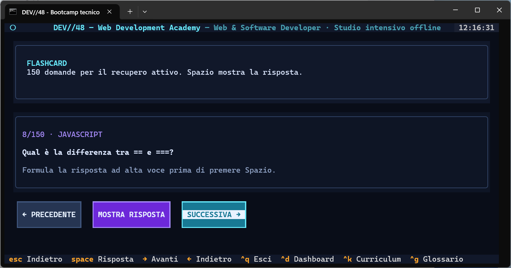
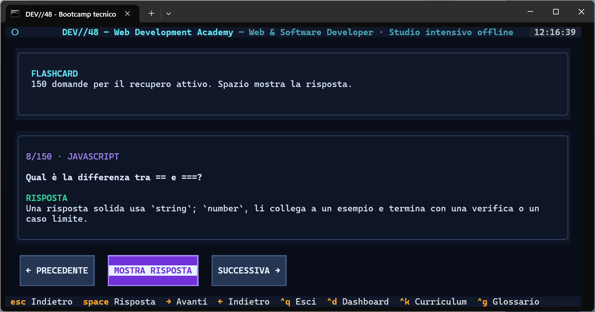
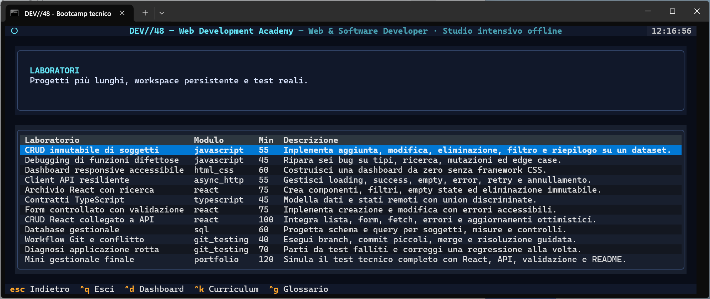
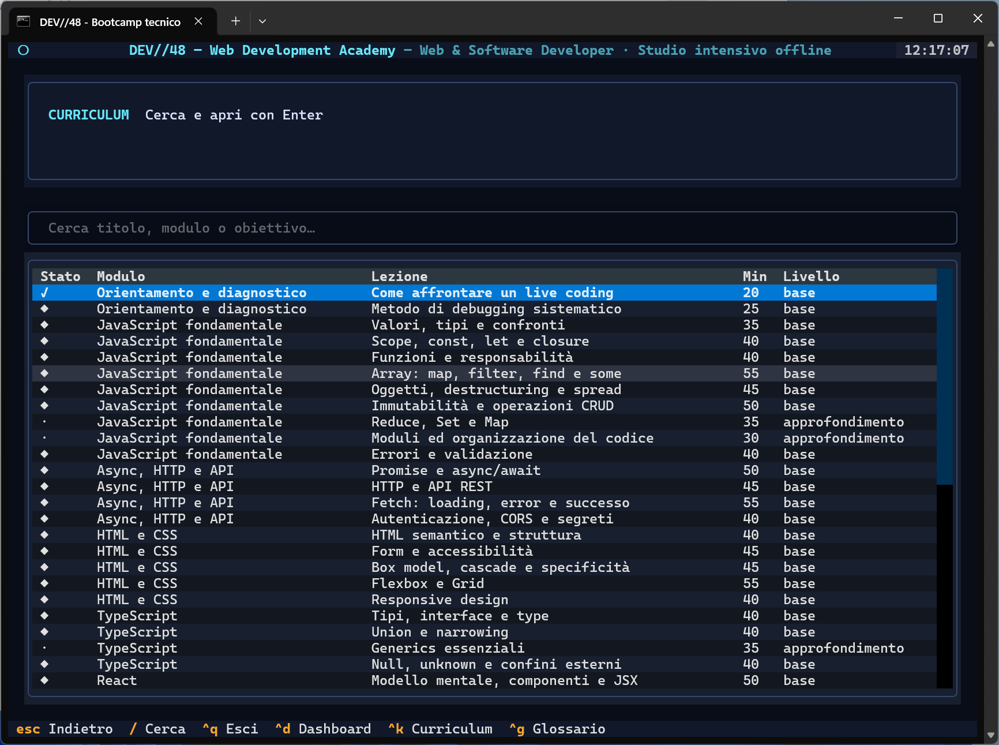

# DEV//48 — Percorsi di studio web e software

DEV//48 è una piattaforma di studio in italiano per lo sviluppo web e software. L'interfaccia è una TUI Python/Textual pensata per PowerShell; codice, test e laboratori restano file normali sul computer.

La piattaforma contiene tre percorsi, selezionabili all'avvio o con `Ctrl+T` quando non è in corso la simulazione completa:

1. **Angular e .NET:** basi di C#, TypeScript, HTML e CSS, poi API con ASP.NET Core, Entity Framework Core e applicazioni con Angular 22, Signals e Control Flow. I laboratori collegano client e server (`client/` e `server/`).
2. **JavaScript e React:** JavaScript, React 19, Node.js, SQLite e test con Vitest. TypeScript, routing, WordPress ed Electron sono approfondimenti; funzioni, moduli, copie e asincronia preparano all'uso di React.
3. **Preparazione Amazon SDE-I OA:** piano essenziale di sei giorni, 44 lezioni, 67 esercizi di algoritmi e strutture dati con varianti Python e C++ (22 facili, 35 medi, 10 difficili), sei laboratori su repository, 160 flashcard, quattro simulazioni, 36 scenari Work Simulation e otto attività Work Style.

Ogni percorso mantiene catalogo e progresso separati. Alla prima schermata scegli `1`, `2` o `3`; puoi anche usare le frecce e Invio. `Ctrl+T` riapre la selezione. Il piano essenziale Amazon richiede circa 37,8 ore, in base alle scelte salvate; il catalogo completo stima 55,7 ore includendo anche attività facoltative. Gli scenari singoli non hanno una durata predefinita.

Il percorso include simulazioni da 25, 40 e 60 minuti e una prova completa: 40 minuti per un problema, poi 60 minuti su un progetto. I timer sono indipendenti: il tempo inutilizzato non passa alla sezione successiva. La prova non genera un riepilogo finale. Il processo Amazon effettivo può variare in base al ruolo, al paese e all'invito ricevuto.

## Controlli e relativi limiti

Le verifiche dichiarano che cosa controllano:
- **C# e JavaScript:** il codice viene compilato o eseguito localmente e confrontato con i casi indicati nell'esercizio.
- **TypeScript e Angular:** gli esercizi brevi controllano la logica isolata con un modello semplificato. Non avviano Angular, non compilano i tipi o i template e non controllano la pagina nel browser.
- **SQL:** la query viene eseguita su un database SQLite temporaneo.
- **HTML, CSS e React:** i controlli cercano la struttura e i requisiti dichiarati; non mostrano la pagina né verificano le interazioni nel browser.
- **Richiami teorici:** il controllo verifica soltanto la presenza dei termini richiesti. Non interpreta la risposta: confrontala con il modello.
- **Laboratori:** il pulsante esegue la suite inclusa nello starter: test Node.js, React, xUnit, Angular o C++20, secondo il progetto. Un esito positivo vale solo per quei test; usa requisiti e criteri del laboratorio per valutare gli aspetti non coperti.

Le estensioni facoltative non assegnano XP automatici.

## Anteprima

### Dashboard e percorso guidato



### Esercizi interattivi



### Flashcard

| Domanda | Risposta |
|---|---|
|  |  |

### Laboratori e curriculum

| Laboratori pratici | Curriculum ricercabile |
|---|---|
|  |  |

## Avvio rapido

1. Fai doppio clic su **`Avvia DEV48.bat`**.
2. Solo al primo avvio attendi la creazione di `.venv` e l'installazione delle dipendenze Python.
3. Scegli `1`, `2` o `3` nella schermata iniziale. Usa **`Ctrl+T`** per tornare al selettore dei tre percorsi.

Requisiti: Windows 10/11, Python 3.11+, .NET SDK 10 e Node.js. Per Angular 22 scegli una versione Node compatibile con la [tabella ufficiale](https://angular.dev/reference/versions); i nuovi laboratori JavaScript e React richiedono Node.js 24 LTS. Git e VS Code sono consigliati per i laboratori. Esegui **`Diagnostica DEV48.bat`** per controllare l'ambiente. Consulta anche il [ciclo di supporto .NET](https://learn.microsoft.com/dotnet/core/releases-and-support).

Avvio equivalente da PowerShell:

```powershell
cd "C:\percorso\DEV48"
.\.venv\Scripts\python.exe -m dev48
```

## Comandi dell'interfaccia

| Tasto | Azione |
|---|---|
| Frecce | Navigano subito nella schermata: selezione nelle tabelle, scorrimento nei testi, cursore nell'editor e cambio flashcard |
| `Invio` | Apre la voce selezionata / continua |
| `Ctrl+T` | Apre il selettore dei tre percorsi, tranne durante la simulazione completa |
| `Ctrl+S` | Salva la risposta, completa una lezione o mostra il confronto di uno scenario |
| `F5` | Avvia il controllo previsto per l'esercizio o la simulazione corrente |
| `F1` | Mostra la traccia o la teoria, conservando risposta e posizione di lettura finché l'esercizio resta aperto |
| `H` | Mostra l'indizio successivo |
| `Esc` | Torna alla schermata precedente |
| `Ctrl+K` | Apre il curriculum |
| `Ctrl+G` | Apre il glossario |
| `Ctrl+D` | Torna alla dashboard |
| `Ctrl+Q` | Chiude salvando il progresso |
| `Spazio` | Mostra la risposta di una flashcard; nelle simulazioni abilitate avvia o mette in pausa il timer |
| `/` | Porta il focus alla ricerca in curriculum e glossario |

La soluzione completa si sblocca dopo due controlli, anche se non sono falliti. In una riflessione, il controllo cerca soltanto i termini indicati. Con `F1` puoi passare dalla traccia alla teoria senza perdere risposta, cursore o posizione di lettura mentre l'esercizio resta aperto.

## Preparazione Amazon SDE-I OA

Il piano essenziale distribuisce la scelta del linguaggio e due progetti dimostrativi nel Giorno 1; tecniche lineari e una prova da 25 minuti nel Giorno 2; ricerca e laboratorio nel Giorno 3; liste, alberi e grafi nel Giorno 4; heap, greedy, backtracking, programmazione dinamica e prova da 40 minuti nel Giorno 5; debugging, scenari e simulazione completa nel Giorno 6. Dopo il confronto iniziale puoi scegliere Python o C++ e lo stack Node.js o C++ per i laboratori. Il piano si adatta alle preferenze salvate.

Il piano essenziale richiede circa 37,8 ore complessive, senza pause; include ogni giorno 15 minuti di flashcard e 20 minuti per rivedere gli errori. Gli esercizi fuori dal piano e lo stack non scelto sono facoltativi. I 67 esercizi hanno varianti Python e C++: 22 facili, 35 medi e 10 difficili. I sei laboratori comprendono due versioni del progetto usato nella prova completa.

I sei laboratori passano da progetti dimostrativi in C++ e Node.js a una funzione asincrona, un inventario, un contratto API e un progetto finale con difetti distribuiti fra route, servizio e archivio dati. Nel progetto finale i file da correggere non sono indicati. La prova online effettiva può usare tecnologie diverse: questo percorso offre esempi eseguibili in C++ e Node.js, senza presumere che la prova riutilizzi lo stesso progetto. Node.js usa `npm test`; C++ richiede GCC o Clang con lo standard C++20. La diagnostica controlla il compilatore, necessario solo per le attività C++.

Le prove di programmazione e di progetto hanno timer autonomi; durante il tentativo non puoi consultare indizi o soluzioni. Nella prova completa, allo scadere dei 40 minuti inizia la sezione di 60 minuti sul progetto. Al termine puoi chiudere la simulazione; l'app non crea un riepilogo. I 36 scenari Work Simulation e le otto attività Work Style offrono spunti di riflessione, non un punteggio di selezione né una previsione dell'esito di candidatura.

## Laboratori

Dalla scheda di un laboratorio:

1. premi **Apri VS Code** per creare lo starter e aprire la cartella. Se VS Code non si apre, usa il percorso mostrato nell'app;
2. premi **Prepara dipendenze** per ripristinare i pacchetti .NET o Node necessari. Nei laboratori C++ il pulsante controlla che GCC o Clang sia disponibile: non installa il compilatore;
3. modifica i file nella cartella `workspace/<id-lab>`;
4. premi **Esegui test** nell'app oppure usa il comando indicato nel README del laboratorio, per esempio `dotnet test Tests/Server.Tests.csproj`, `npm test` o la suite C++20.

DEV//48 aggiunge i file mancanti senza sovrascrivere il lavoro esistente. Quando riconosce un vecchio starter Angular simulato o un progetto .NET 8, lo sposta in una cartella `*-legacy` prima di creare il progetto aggiornato. I laboratori Angular usano Angular CLI 22, Vitest e TestBed; quelli .NET usano .NET 10 e xUnit. I progetti Amazon usano Node.js senza pacchetti esterni oppure compilazione C++20. Le versioni sono indicate nei file `package.json` e `.csproj` dei laboratori.

I nuovi laboratori JavaScript e React richiedono **Node.js 24 LTS**. I laboratori JavaScript, fetch, TypeScript, SQL e debugging usano test Node senza pacchetti aggiuntivi; SQLite viene eseguito tramite `node:sqlite`. I richiami sono autoverifiche senza XP: il controllo cerca i termini richiesti e non valuta il significato. Gli XP già salvati restano conservati.

Se una cartella JavaScript o React contiene già `package.json` ma non `dev48-scaffold.json`, l'app conserva il progetto. Negli altri casi aggiunge soltanto i file mancanti; gli starter nuovi riportano `dev48-scaffold.json`. Per provare uno starter aggiornato senza toccare il lavoro esistente, rinomina la vecchia cartella e riapri il laboratorio.

## Salvataggio, backup e privacy

- Il progresso è salvato subito in `data/progress.sqlite3`.
- L'app ricorda l'ultima attività visitata e conserva risposte, tentativi, XP, indizi e tempo totale trascorso. I timer delle prove ripartono dall'inizio quando riapri una schermata.
- `data/backups/progress_latest.json` è un backup leggibile aggiornato dopo i risultati e alla chiusura.
- `data/.dev48.lock` impedisce due istanze contemporanee. Un lock lasciato da una chiusura forzata viene riconosciuto e sostituito automaticamente al prossimo avvio.
- Non esistono account, telemetria, cloud o invii remoti dei contenuti.

Per conservare uno snapshot personale basta copiare `data/progress.sqlite3` e `data/backups/progress_latest.json` mentre l'app è chiusa. Per ricominciare senza perdere i dati, chiudi DEV//48 e **rinomina** `progress.sqlite3`, per esempio in `progress-precedente.sqlite3`; al nuovo avvio verrà creato un database vuoto.

## Come vengono corretti gli esercizi

- **JavaScript e Python:** Node.js o Python vengono avviati in una cartella temporanea con timeout e limite di output; gli esercizi Amazon usano i casi previsti per il linguaggio selezionato.
- **C++:** gli esercizi Amazon vengono compilati come C++20 con GCC o Clang, poi eseguiti con timeout e limite di output. Senza compilatore, l'app indica che il controllo C++ non è disponibile.
- **C#:** il codice viene compilato dal .NET SDK 10 in un progetto temporaneo.
- **TypeScript e Angular brevi:** Node.js esegue la logica dopo aver rimosso le annotazioni di tipo. Il controllo non sostituisce il compilatore TypeScript né Angular.
- **SQL:** le query girano su un database SQLite temporaneo ricreato per ogni prova.
- **HTML/CSS e React breve:** vengono controllati struttura e requisiti mirati.
- **Richiami teorici:** checklist trasparente dei termini richiesti e confronto con risposta modello.
- **Laboratori:** il controllo esegue la suite inclusa nel progetto, per esempio Node.js, React, xUnit, Angular o C++20.

I controlli di codice impongono timeout e limite di output, ma non isolano il processo dal sistema operativo: il codice può accedere ai file e alla rete con i permessi del tuo account. Il codice scritto nell'editor viene eseguito localmente.

## Mappa dei file

| Percorso | A cosa serve | Si può modificare? |
|---|---|---|
| `Avvia DEV48.bat` | Primo setup e avvio normale | Meglio di no |
| `Diagnostica DEV48.bat` | Controlla ambiente, cataloghi, scrittura ed esecuzione del codice | Sì, non necessario |
| `README.md` | Questo manuale | Sì |
| `requirements.txt` | Dipendenze Python minime | Solo per manutenzione |
| `pyproject.toml` | Metadati Python e configurazione pytest | Solo per manutenzione |
| `dev48/__main__.py` | Entry point di `python -m dev48` | Solo per sviluppo |
| `dev48/app.py` | Schermate, navigazione e comandi Textual | Solo per sviluppo |
| `dev48/styles.tcss` | Tema graphite/ciano/viola | Sì, per personalizzare il tema |
| `dev48/models.py` | Modelli e validazione del catalogo | Solo per sviluppo |
| `dev48/database.py` | SQLite, backup e blocco seconda istanza | Solo per sviluppo |
| `dev48/runners.py` | Controlli automatici per JavaScript, SQL, HTML, React e laboratori | Solo per sviluppo |
| `dev48/workspace.py` | Creazione dei progetti di laboratorio, dipendenze e apertura VS Code | Solo per sviluppo |
| `content/catalog.json` | Manifest del percorso JavaScript & React | Non modificare a mano |
| `content/catalog_dotnet_angular.json`, `content/catalog_amazon_sde.json` | Manifest dei relativi percorsi | Non modificare a mano |
| `content/lessons/*.md`, `content/lessons_dotnet/*.md`, `content/lessons_amazon/*.md` | Testi generati delle lezioni | Modificare il relativo generatore |
| `tools/generate_content.py`, `tools/generate_dotnet_angular.py`, `tools/generate_amazon_sde.py` | Sorgenti editoriali che rigenerano i cataloghi | Solo per manutenzione |
| `tools/js_react_notes.py`, `tools/js_react_practice.py`, `tools/js_react_lab_briefs.py` | Testi, pratica e contratti dei laboratori JavaScript/React, usati dal generatore | Solo per manutenzione |
| `dev48/js_react_scaffolds.py` | Starter, test e soluzioni dei laboratori JavaScript/React | Solo per manutenzione |
| `dev48/js_react_ui_scaffolds.py` | Laboratori React, test delle interazioni e API locale didattica | Solo per manutenzione |
| `tools/doctor.py` | Diagnostica richiamata dal file `.bat` | Solo per sviluppo |
| `tests/` | Test automatici di cataloghi, database, controlli e interfaccia | Sì, per sviluppo |
| `data/` | Stato personale e backup, creati a runtime | Non mentre l'app è aperta |
| `workspace/` | Codice modificabile dei laboratori e repository di pratica | **Sì: è il tuo lavoro** |
| `.venv/` | Ambiente Python isolato, ricreabile | Non modificare |

Attenzione: ciascun generatore riscrive il relativo catalogo e i Markdown generati. Eseguilo soltanto se stai mantenendo il contenuto editoriale.

## Diagnostica e test

In caso di dubbio esegui **`Diagnostica DEV48.bat`**. Controlla Python, Textual, Node/npm, tutti i cataloghi, la scrittura locale e l'esecuzione di esempi JavaScript, Python e C#. Git, VS Code e il compilatore C++ sono facoltativi.

Suite completa per chi modifica il programma:

```powershell
cd "C:\percorso\DEV48"
.\.venv\Scripts\python.exe -m pytest -q
```

La suite verifica tutte le 100 soluzioni brevi JavaScript/React, le 106 soluzioni Angular/.NET e le 67 varianti Python del percorso Amazon. Controlla anche tutte le varianti C++ se GCC o Clang è installato. Include prove per errori di sintassi e di esecuzione, risposte errate, timeout e output eccessivo.

Per JavaScript/React verifica tutte le 100 soluzioni brevi e gli otto laboratori Node. Per eseguire anche i quattro laboratori React, installa le dipendenze di un laboratorio nuovo con `npm install` e imposta `DEV48_REACT_NODE_MODULES` al percorso assoluto della sua cartella `node_modules` prima di pytest. Senza questa variabile, i quattro test UI vengono segnalati come saltati; i test negli stessi progetti si eseguono comunque con `npm test`. I test JSX brevi controllano struttura e testo: le interazioni reali vengono provate nei laboratori.

## Risoluzione dei problemi

**La finestra dice che Python non è trovato.** Installa Python 3.11+ da python.org, seleziona “Add Python to PATH”, chiudi e riapri PowerShell.

**Il primo setup si è interrotto.** Controlla la connessione, chiudi DEV//48 e rilancia `Avvia DEV48.bat`. Se `.venv` esiste ma Textual manca, il launcher completa automaticamente l'installazione.

**Node o npm non sono trovati.** Reinstalla Node.js LTS includendo npm, poi riapri PowerShell e lancia la diagnostica.

**VS Code non si apre.** In VS Code esegui dalla Command Palette “Shell Command: Install 'code' command in PATH”, oppure apri manualmente la cartella indicata nella scheda del lab.

**Un laboratorio React non parte.** Dalla cartella del lab esegui `npm install`, poi `npm test -- --run`. Se l'installazione è stata interrotta, ripetila; `package-lock.json` manterrà le versioni risolte.

**L'app afferma di essere già aperta.** Cerca prima un'altra finestra DEV//48. Se non esiste, rilancia: i lock dei processi terminati vengono ripuliti automaticamente. Non cancellare il lock mentre un'altra istanza è attiva.

**Il servizio di sincronizzazione cloud mostra un conflitto.** Chiudi l'app, attendi la fine della sincronizzazione e riaprila. Non usare la stessa cartella simultaneamente da due computer.

**Il terminale è troppo piccolo o i simboli sono strani.** Allarga PowerShell almeno a circa 110×35 caratteri e usa Windows Terminal o PowerShell con un font Unicode moderno.

## Aggiornamento controllato

Per riallineare le dipendenze Python dichiarate:

```powershell
.\.venv\Scripts\python.exe -m pip install -r requirements.txt
.\.venv\Scripts\python.exe -m pytest -q
```

Non è necessario aggiornare i pacchetti durante una sessione di studio: l'ambiente già verificato è più prevedibile.
